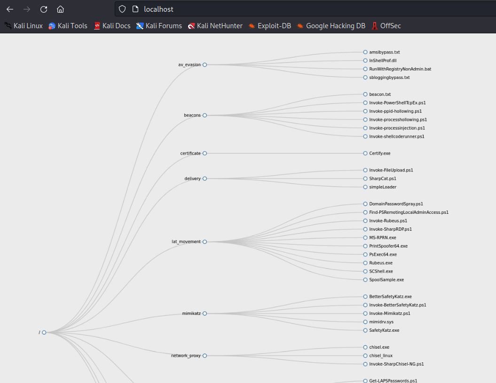

# directory-sync-httpserver

Better visual and organisation, just what you need!

you just want to front all the files at root, so you don't have to remember which folder has which files. For example, your webserver's directory looks like this.

```
Folder1
- script.ps1
- script2.ps1
Folder2
- script3.ps1
- script4.ps1
```

If you want to download file at `wget http://server/Folder1/script.ps1`, it's tedious to specify `Folder1`.

To save time, this custom service was created. Front all the files at root `http://server/script3.ps1` as such.

The visualized image of your webserver is accessible at `http://server/index.html` by default.



## Required Packages

```
sudo gem install dirtree
sudo apt install inotify-tools
```

## Set up a script

Use `inotify`, the most efficient monitoring tool for *nix system.

Use webserver of your choice such as Nginx,Apache,etc. 

place this file at `/etc/inotify.custom/run.sh`


```bash
#!/bin/bash

if [ -z "$(which inotifywait)" ]; then
    echo "inotifywait not installed."
    echo "In most distros, it is available in the inotify-tools package."
    exit 1
fi

$syncfolder="/home/kali/originalFolder"
$webserver="/var/www/"

inotifywait --recursive --monitor --format "%e %w%f" \
--event modify,move,create,delete $syncfolder \
| while read changed; do
    echo $changed
    find $syncfolder -type f -exec cp {} $webserver \;
    cd $webserver && dirtree -o ${webserver}index.html **/* *
done
```

## Set up a Service

Save this file at `/etc/systemd/system/inotify.custom.service`

```
[Install]
WantedBy=multi-user.target

[Unit]
Description=Beautiful Lab Web Server

[Service]
User=root
WorkingDirectory=/etc/custom.inotify/
ExecStart=/bin/bash run.sh
Restart=always
```

## Run as Service

```
sudo systemctl daemon-reload
sudo systemctl start inotify.custom.service
# if you want to run at startup
sudo systemctl enable inotify.custom.service
```

## Credit

https://github.com/emad-elsaid/dirtree

https://www.baeldung.com/linux/command-execute-file-dir-change
